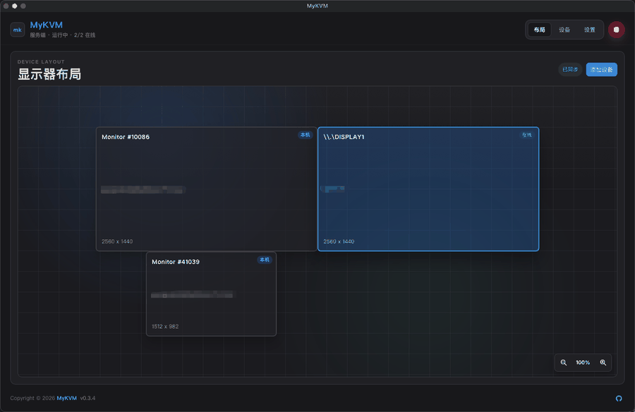
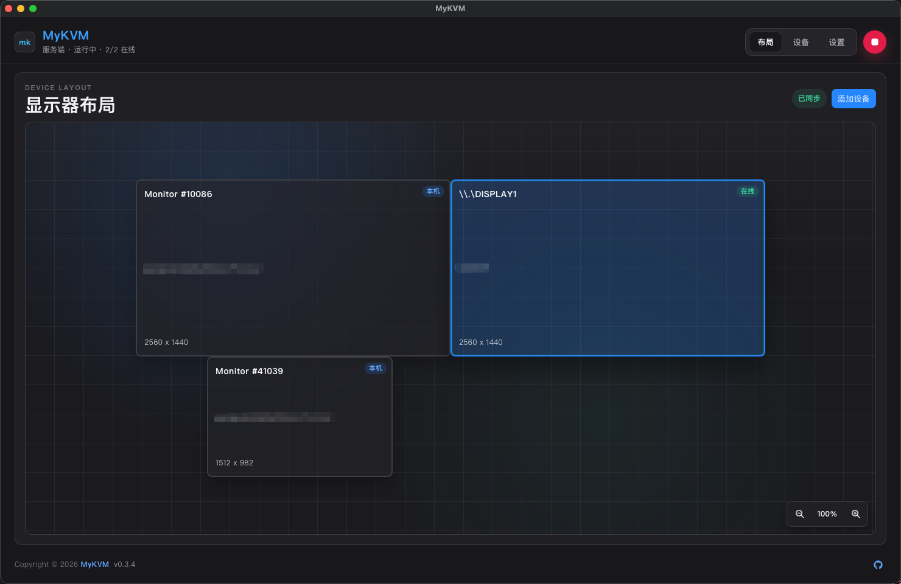
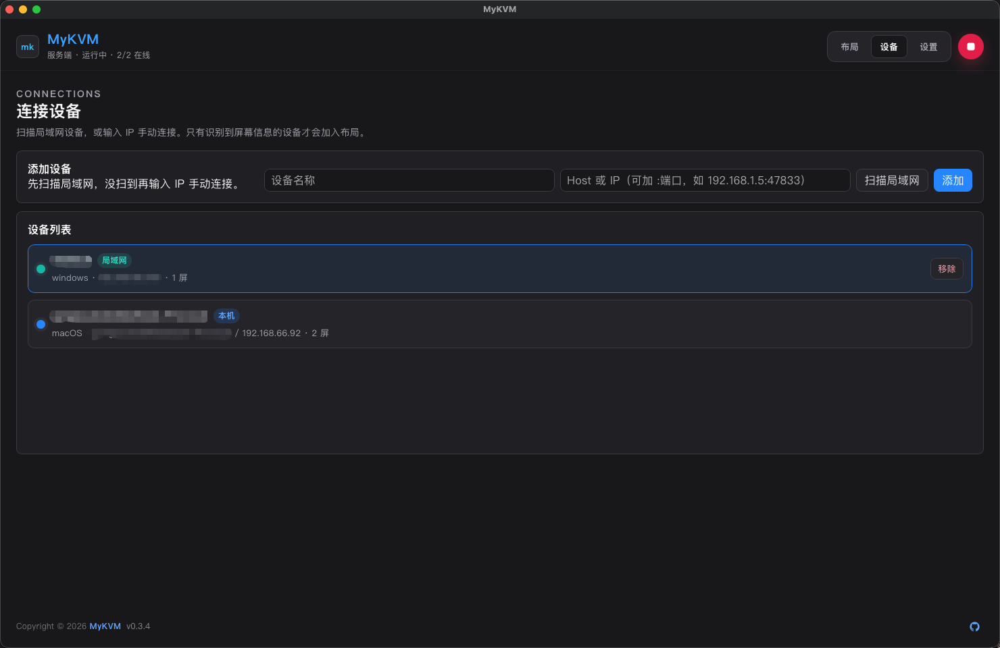
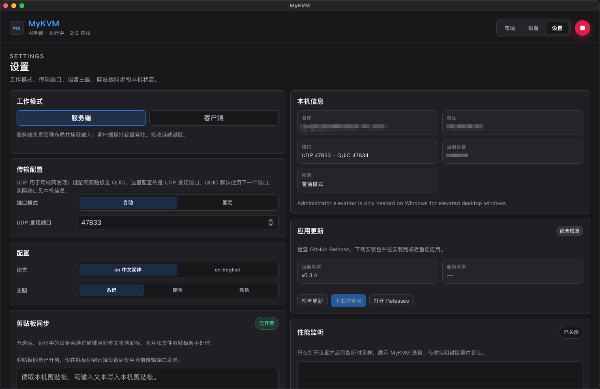

# MyKVM

**一套键盘、一只鼠标、一份剪贴板 —— 在同一局域网内的 Mac、Windows、Linux 之间共享。**

把光标移出一台屏幕的边缘，它就落到下一台机器上；键盘随之切换，剪贴板（文本和图片）自动同步。不需要 KVM 硬件，也不用插线。

[](https://github.com/XxMinor/mykvm/releases/latest)
[](https://github.com/XxMinor/mykvm/stargazers)
[](https://github.com/XxMinor/mykvm/forks)
[](https://github.com/XxMinor/mykvm/releases/latest)
[](./LICENSE)
[![LINUX DO](https://img.shields.io/badge/LINUX-DO-FFB003.svg?logo=data:image/svg%2bxml;base64,DQo8c3ZnIHhtbG5zPSJodHRwOi8vd3d3LnczLm9yZy8yMDAwL3N2ZyIgd2lkdGg9IjEwMCIgaGVpZ2h0PSIxMDAiPjxwYXRoIGQ9Ik00Ni44Mi0uMDU1aDYuMjVxMjMuOTY5IDIuMDYyIDM4IDIxLjQyNmM1LjI1OCA3LjY3NiA4LjIxNSAxNi4xNTYgOC44NzUgMjUuNDV2Ni4yNXEtMi4wNjQgMjMuOTY4LTIxLjQzIDM4LTExLjUxMiA3Ljg4NS0yNS40NDUgOC44NzRoLTYuMjVxLTIzLjk3LTIuMDY0LTM4LjAwNC0yMS40M1EuOTcxIDY3LjA1Ni0uMDU0IDUzLjE4di02LjQ3M0MxLjM2MiAzMC43ODEgOC41MDMgMTguMTQ4IDIxLjM3IDguODE3IDI5LjA0NyAzLjU2MiAzNy41MjcuNjA0IDQ2LjgyMS0uMDU2IiBzdHlsZT0ic3Ryb2tlOm5vbmU7ZmlsbC1ydWxlOmV2ZW5vZGQ7ZmlsbDojZWNlY2VjO2ZpbGwtb3BhY2l0eToxIi8+PHBhdGggZD0iTTQ3LjI2NiAyLjk1N3EyMi41My0uNjUgMzcuNzc3IDE1LjczOGE0OS43IDQ5LjcgMCAwIDEgNi44NjcgMTAuMTU3cS00MS45NjQuMjIyLTgzLjkzIDAgOS43NS0xOC42MTYgMzAuMDI0LTI0LjM4N2E2MSA2MSAwIDAgMSA5LjI2Mi0xLjUwOCIgc3R5bGU9InN0cm9rZTpub25lO2ZpbGwtcnVsZTpldmVub2RkO2ZpbGw6IzE5MTkxOTtmaWxsLW9wYWNpdHk6MSIvPjxwYXRoIGQ9Ik03Ljk4IDcwLjkyNmMyNy45NzctLjAzNSA1NS45NTQgMCA4My45My4xMTNRODMuNDI2IDg3LjQ3MyA2Ni4xMyA5NC4wODZxLTE4LjgxIDYuNTQ0LTM2LjgzMi0xLjg5OC0xNC4yMDMtNy4wOS0yMS4zMTctMjEuMjYyIiBzdHlsZT0ic3Ryb2tlOm5vbmU7ZmlsbC1ydWxlOmV2ZW5vZGQ7ZmlsbDojZjlhZjAwO2ZpbGwtb3BhY2l0eToxIi8+PC9zdmc+&style=for-the-badge)](https://linux.do/)
[![XQAPI](https://img.shields.io/badge/XQAPI-AI-2786FF.svg?logo=data%3aimage%2fpng%3bbase64%2ciVBORw0KGgoAAAANSUhEUgAAABAAAAAQCAYAAAAf8%2f9hAAAAAXNSR0IArs4c6QAAAERlWElmTU0AKgAAAAgAAYdpAAQAAAABAAAAGgAAAAAAA6ABAAMAAAABAAEAAKACAAQAAAABAAAAEKADAAQAAAABAAAAEAAAAAA0VXHyAAACkElEQVQ4EZVTTUhUURT%2b3pvne%2fPn5MZo1Ewc1MUMJE1t8o9oHZQTBQpty8pdQbQp6Fcq%2bqEoopD%2bFoW%2f7YoWiaUoTjALNQMHrLHAmphxGuf33du5V2coCMID591zz%2fnOd8859z4Fa8I5LyHTnclkNMMweMH%2f50oxhXBmOGz95vUq2WIsl8vtZIyNMpPFSRNkSzVNMyH35DOFfzUWp%2fj7VCrVKgmI0c1Mc4HWdQmRRFaiK1Uqnb5HUdVq8H9WXayyaAgcqaIolVqp1q4JQwRFukI6MDiM5y%2f6yMHQ2dkBi6ri8dNntGUIBNpx8MB%2byicCgVcsVRqtjFQw4sHDXvQ%2beoLTp07C0A2cu3AJ2Vye9ifgdDpx%2fmIPfkSjONZ1WKSQECu1cEY0H4vFeHPbbv5xbo4z2g8ODfOpYJBHIos8nU7z%2fv4BPjY%2bzptadvFo9KdI4ZR7WV1lAggIh8OBhvp6TExMYt%2feAEZGRlFZWYFXr99Q%2bQHMzMzC7d5E2Mhamooigd1uRz7PSPOwGgacZWVwuVwSaLdZYXVsgE5tpdIZCGxBigTV1ZvhKnXg7r37aGzcivF3b7Hw%2bQuuXL2OtrZWBCfHsLT0nUhKUFOzZS2fQREz0DTtrPDMz4dx5Gi3bMXQdVg0TU4%2fm82SbUF8OYHbN6%2bhrq5OwEW1PeIWZBU0E3g8tXg51Iep4AeEQiF4amuhWjRMT09jx3Y%2f%2fP5tsnyBFbdGqapGzzVGFch7FQGbzYaW5iZsLC%2fHjVt3wMw8uo93wefziUPlG5AGfWhmMSwvpxvonccpeV1CB%2f9KJBJeSZZKZTrobS%2bS%2fpdEYEi%2f0s90SCSLRqQkk8kKXdcbAJoW8gX3Xyt1SmXDpMF%2foqtcFMHfSC7T5ZzIvHoAAAAASUVORK5CYII%3d&style=for-the-badge)](https://xqapi.com/)

[English README](./README.md)



## 截图

| 显示器布局 | 连接设备 | 设置 |
| --- | --- | --- |
|  |  |  |

## 快速开始

1. **两台机器都安装。** 从 [最新发布](https://github.com/XxMinor/mykvm/releases/latest) 下载各自系统的安装包。
2. **选择角色。** 在要共享键鼠的那台机器上打开 MyKVM，保持 **服务端**（默认）。在另一台机器上打开 MyKVM，到设置里切换为 **客户端**。
3. **建立连接。** 同一局域网下两台会自动发现。否则打开 **设备**，输入对方 IP（可加 `IP:端口`），点 **添加**。只有上报了屏幕信息的设备才会加入布局。
4. **排列屏幕。** 打开 **布局**，拖动各显示器，让相邻边缘和它们在桌面上的实际位置一致。
5. **跨屏切换。** 把光标推出相邻边缘，它就切到另一台机器；键盘随之跟随，复制粘贴双向可用。

## 权限说明

- **macOS（服务端）。** 在 系统设置 → 隐私与安全性 中给 MyKVM 同时授予 **辅助功能（Accessibility）** 和 **输入监控（Input Monitoring）**，这是捕获和注入键鼠输入所必需的。签名版本在更新后会保留授权；万一掉了，关掉再打开即可。
- **macOS 首次打开。** 版本是免费自签名（未经过 Apple 公证），所以首次会被 Gatekeeper 拦。右键点应用 → **打开** → **打开** 放行一次即可。
- **Windows。** 常规使用无需特殊权限。只有需要控制提权/管理员窗口时才以管理员身份运行。
- **Linux。** 用 AppImage 的话，先给它加可执行权限（`chmod +x`）。

## 已知限制

- **仅限可信局域网。** 支持配对码和已配对设备证书绑定；局域网发现仍是明文。请勿把端口暴露到公网或不可信网络。
- 输入和剪贴板走 **加密的 QUIC/TLS** 连接，并绑定对端广播的证书；但 MyKVM 仍是原型，未针对恶意网络做加固。
- 剪贴板支持文本、图片、HTML／RTF。文件和文件夹通过按需粘贴传输，需两端更新；单文件及文件夹内容上限 2 GiB。
- macOS 版本是 **自签名、未公证**，首次打开会有 Gatekeeper 提示。
- 实验性软件：协议和行为可能在版本间变化。

---

## 功能

- 支持 Server / Client 两种工作模式。
- 支持局域网设备发现。
- 支持通过主机名或 IP 手动连接设备。
- 支持本机显示器检测和多显示器布局编辑。
- 通过加密的 QUIC 连接共享键盘和鼠标输入。
- 通过同一条加密连接同步剪贴板的文本、图片和富文本。
- 服务端设置中的“游戏与防误切”支持锁定本机（默认 Alt+Shift+L）、全屏保护和按应用禁止跨屏。锁定仅暂停键鼠跨屏，剪贴板由独立开关控制。
- “按需粘贴”保留本机剪贴板；控制客户端时按 Ctrl／Command+V 发送并粘贴本机内容，回到本机后按 Alt+Shift+V 拉取并粘贴另一台的内容。文件或文件夹也使用此方式。
- 支持文件夹层级和空目录、传输取消；新协议需两端更新。Linux 原生 X11／Wayland 键鼠后端尚未实现。
- 支持浅色、深色和跟随系统主题。
- 支持英文和简体中文界面。
- 支持托盘隐藏和恢复主窗口。
- 支持检查 GitHub Release 并原地自动更新。

## 当前状态

MyKVM 是一个实验性的早期版本，适合在本地可信网络中测试和迭代，但还没有面向不可信网络做生产级加固。当前版本和安装包见 [Releases 页面](https://github.com/XxMinor/mykvm/releases)。

- 许可证：MIT
- 默认端口：UDP `47833`（发现）和 UDP `47834`（QUIC 传输）
- 剪贴板载荷上限：文本 256 KB，图片 32 MB
- 传输安全：输入和剪贴板走 TLS 1.3（QUIC）连接，并绑定对端在发现阶段广播的证书
- 安全模型：可信局域网原型
- 暂未包含：完整的发现通道身份认证和面向不可信网络的生产级传输加固

请不要把传输端口暴露到公网或不可信网络。

## 协议

MyKVM 使用两条通道：局域网发现走普通 UDP 端口；输入和剪贴板走另一个 UDP 端口上的加密 QUIC 连接。

| 通道 | 默认端口 | 传输方式 | 协议标记 | 用途 |
| --- | --- | --- | --- | --- |
| 发现 | UDP `47833` | UDP 数据报 | `mykvm.discovery.v1` | 局域网发现、设备探测/回应、主机信息和屏幕元数据 |
| 输入 | UDP `47834` | QUIC datagram | `mykvm.input.v1` | 鼠标移动、鼠标按键、滚轮和键盘事件（低延迟、容忍丢包） |
| 剪贴板 | UDP `47834` | QUIC stream | `mykvm.clipboard.v1` | 剪贴板文本和图片同步（可靠、有序） |

发现端口可以在设置中固定（默认 UDP `47833`）；QUIC 传输端口默认取发现端口 + 1（UDP `47834`）。两者在端口被占用时都会向附近端口自动回退，必要时交给系统分配端口。设备会广播自己的发现端口、QUIC 端口、传输公钥和协议版本，因此局域网发现和手动添加都能连到正确端口并绑定正确的证书。

QUIC 连接使用 TLS 1.3 加密：每个端在启动时生成一张自签名证书并在发现阶段广播，连接方会 pin 住这张证书，因此输入和剪贴板流量是加密的、且只绑定到广播该证书的对端。发现通道本身仍是明文且未认证，因此请把 MyKVM 保持在可信局域网内使用。

## 环境要求

- Node.js 22+
- Rust stable
- 平台桌面工具链：
  - Windows：Microsoft C++ Build Tools
  - macOS：Xcode Command Line Tools
  - Linux：WebKitGTK 和 appindicator 开发包

## 开发

安装依赖：

```bash
npm install
```

运行 Web UI：

```bash
npm run dev
```

运行 Tauri 桌面端：

```bash
npm run tauri:dev
```

构建但不打安装包：

```bash
npm run tauri:build
```

构建桌面安装包：

```bash
npm run tauri:bundle
```

## 平台辅助脚本

Windows：

```powershell
powershell -ExecutionPolicy Bypass -File .\scripts\check-dev-env.ps1
powershell -ExecutionPolicy Bypass -File .\scripts\run-tauri-dev.ps1
```

macOS 和 Linux：

```bash
sh scripts/check-dev-env.sh
sh scripts/run-tauri-dev.sh
```

macOS 的输入捕获和注入需要在系统设置中授权 Accessibility 和 Input Monitoring。

## 验证

提交 PR 或发布版本前建议运行：

```bash
npm run build
npm run lint
cargo check --manifest-path src-tauri/Cargo.toml
```

## 发布

Git 本身只负责保存源码历史和推送提交。真正的打包、编译和生成安装包由 GitHub Actions 在 GitHub runner 上完成。

Release 工作流会监听 `main` 分支推送：

- `feat:` 发布下一个 minor 版本，例如 `v0.1.0` 到 `v0.2.0`。
- `fix:` 发布下一个 patch 版本，例如 `v0.1.0` 到 `v0.1.1`。
- 其他前缀只运行常规检查，不发布版本。
- 如果仓库还没有任何 release tag，第一个 `feat:` 或 `fix:` 推送会发布 `v0.1.0`。

Release 说明取自 [CHANGELOG.md](./CHANGELOG.md) 的 `## [Unreleased]` 段落（面向用户的措辞），没有则回退到过滤后的提交标题。改动落地时记得同步更新该段落。

示例：

```bash
git commit -m "feat: initial desktop release"
git push origin main
```

工作流会自动创建 git tag，构建 macOS、Windows 和 Linux 安装包，然后发布到 GitHub Release。

## 项目结构

| 路径 | 用途 |
| --- | --- |
| `src/App.tsx` | React 桌面控制台主界面 |
| `src/desktopApi.ts` | 前端到 Tauri 命令的桥接层 |
| `src/layout.ts` | 显示器布局变换和邻接逻辑 |
| `src/runtime.ts` | 运行时状态类型 |
| `src-tauri/src/lib.rs` | Tauri 命令、UDP 设备发现、剪贴板同步、应用状态和性能采样 |
| `src-tauri/src/input.rs` | 输入捕获、转发和注入运行时 |
| `src-tauri/src/quic_transport.rs` | 加密 QUIC 传输（输入 datagram、剪贴板 stream），带证书 pin |
| `scripts/` | 开发和构建辅助脚本 |

## 贡献

欢迎提交 issue 和 pull request。改动请保持聚焦；如果影响协议行为，请在文档中说明；如果触及共享运行时代码，请同时验证 Web 构建和 Tauri 后端。

提交前缀和版本规则见 [CONTRIBUTING.md](./CONTRIBUTING.md)。

## 许可证

MIT。见 [LICENSE](./LICENSE)。
